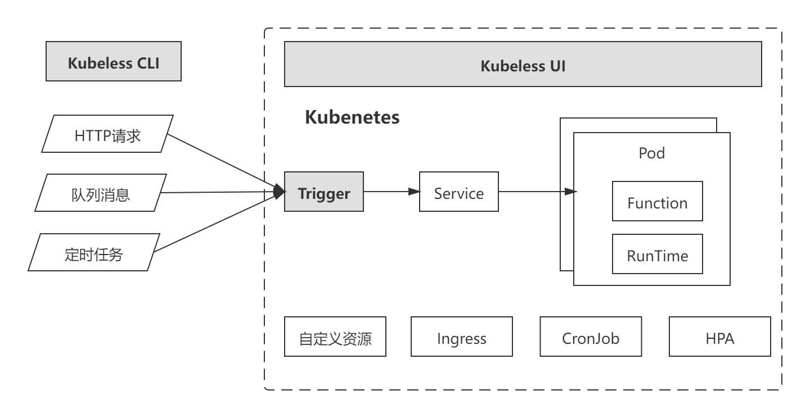

## Kubeless

>  [Kubeless](https://kubeless.io/)是一个基于Kubernetes的开源Serverless Faas平台框架。其项目的定位是增强Kubernetes的能力，使得Kubernetes的应用场景可以延伸至Serverless Faas领域。
>
> Kubeless架构图如图（1），其中灰色部分是Kubeless提供的组件。Kubeless

             
图（1）
 

